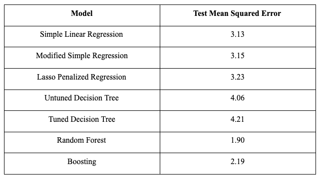

```{r setup, include=FALSE}
knitr::opts_chunk$set(fig.width=6, fig.height=4)
options(scipen = 0, digits = 3)  # controls number of significant digits printed
```

\newpage

# Project Background

Energy consumption is critical for livelihood, and recently a lot of attention has been placed on how energy consumption can be effectively managed. There are more advocates than ever before for a shift toward renewable energy sources, and at the same time some governments cannot acquire enough traditional energy to keep their cities powered. When it comes to making these decisions and solving these problems, it is critical to first understand how energy is used.

Predicting energy consumption is important for many different stakeholders, including energy companies, consumers, alternative energy providers, and even policy makers. Understanding what factors influence energy consumption can better help these individuals make informed decisions when it comes to building, budgeting, marketing, and implementing laws. It is thus important for these stakeholders to better understand what factors influence energy consumption across different factors.

The use of this information will vary for different stakeholders, meaning that the types of factors they are interested in using to predict energy consumption will be different as well. Energy companies, both traditional and alternative, will want to understand which types of consumers use the most energy; traditional providers want to build infrastructure to be able to better serve their customers with high demand, and renewable energy providers want to target the same individuals to both to let them know the benefit of saving costs as well as make the most impact by convincing them to switch. Thus, these players would be interested in demographic factors, such as household income.
	
Individual consumers are aware of their demographic information, and are likely not interested in making predictions about others. They may, however, be interested in budgeting for electricity bills throughout the year, or may want to make the shift to renewable energy at the best possible time. Residents in hotter cities may also realize that they could have significant savings by switching to alternative sources of energy while their counterparts in more moderate climates may realize that the cost of implementing such alternatives would outweigh the savings. Thus, these individuals would likely care less about demographic factors, and more about climate and temporal data.
	
Finally, policy makers that have to decide how to allocate energy resources, or which individuals should receive support to implement alternative energy first would likely be interested in all of these predictors. We thus attempt to predict energy consumption using a variety of factors, including both demographic predictors as well as ones related to time, and weather.


# Executive Summary

This project seeks to predict energy consumption behaviors based on a combination of different demographic, temporal, and weather-based predictors. We analyze 3.5 million observations across different consumers and days. Because the temporal and weather predictors are constant for the same day, and the demographic predictors are the same for the same ACORN class, we group the data by these predictors, looking at the average consumption usage across groups, to get a condensed data set of about 15,000 observations. This condensed data set is used for the final data analysis and model building.

We test a total of seven models, including three classical regression models and four tree based models. Our final model set included a basic regression, a modified regression (in which factors are removed to control for collinearity), a lasso regression, a basic decision tree, a decision tree tuned for splits, a random forest model, and a tree boosting model. We tune some of the more sophisticated models on their underlying attributes. For example, we tune our random forest model and our boosting model for number of trees, random forest for number of attributes per tree, and boosting for the depth of each tree.
	
We find that advanced tree-based models work the best. Specifically, the random forest and boosting models had test MSEs  of 1.90 and 2.19 respectively, compared to the next highest test MSE of 3.13 from the basic linear regression. We are thus confident in the predictive capability of the random forest model for the population on which the data was collected. We found through the tree based models that the most important factors were ACORN class and the maximum temperature of the day.


# Data Cleaning and Exploratory Data Analysis

The initial dataset (retrieved from https://www.kaggle.com/jeanmidev/smart-meters-in-london) consisted of four different tables, which are as follows:

- daily_dataset.csv: This dataset consists of data related to energy consumption for each day and each household from December 2011 to January 2014.

- informations_households.csv: This dataset links each household to their Acorn group (defined later).

- uk_bank_holidays.csv: This dataset lists the days which are bank holidays in the United Kingdom from December 2011 to January 2014.

- weather_daily_darksky.csv: This dataset details the weather metrics for each day in London from December 2011 to January 2014

Since the goal of the study is to predict the energy consumption based on weather and household metrics, we need to combine these different tables into a single table before we proceed to explore and analyze the dataset. The nulls were dropped, integrated variables were created for holidays and weekends, and all of these tables were finally joined (on day) into a single table as shown below.

```{r, echo = FALSE, message = FALSE}
library(tidyverse) # tidyverse
library(tidyr)
library(reshape2)
library(rms)
library(glmnet)
library(fastDummies)
library(rpart)
library(rpart.plot)
library(ISLR)
library(randomForest)
library(gbm)
```

```{r, echo = FALSE, message = FALSE}
set.seed(1) # set seed for reproducibility
```

```{r, echo = FALSE, message = FALSE}
energy_data <- read.csv('energy_dataset.csv')
```

```{r, echo = FALSE, message = FALSE}
energy_data_clean <- subset(energy_data, select = 
                              -c(X, energy_median, energy_mean, energy_max, 
                                 energy_count, energy_min, stdorToU, 
                                 Acorn_grouped, file))
energy_data_clean$day <- as.Date(energy_data_clean$day, format="%Y-%m-%d")
energy_data_clean$month <- format(energy_data_clean$day, "%m")
energy_data_clean <- drop_na(energy_data_clean)
```

```{r, echo = FALSE, message = FALSE}
energy_data_clean[1:10,]
```

The following are the variables in our dataset:

- LCLid: Unique identifier for a household

- day: The day of the measurement

- energy_std: Half Hourly Standard Deviation of the energy measurement

- energy_sum: Total energy consumption for that day in kWh (kiloWatt-hours)

- is_holiday: Binary variable that is 1 if the day of the measurement is a holiday and 0 otherwise

- temperatureMin: Minimum Temperature recorded on the day in Celsius

- temperatureMax: Maximum Temperature recorded on the day in Celsius

- humidity: Percentage level of Humidity recorded on the day

- cloudCover: Percentage of Cloud Cover recorded on the day

- windSpeed: Speed of the wind recorded on the day in metres per second

- dewPoint: Dew point recorded on the day in Celsius

- pressure: Pressure recorded on the day in mbar 

- uvIndex: The ultraviolet index recorded on the day

- is_weekend: Binary variable that is 1 if the day of the measurement is a weekend and 0 otherwise

- month: Month of the day of the measurement

- Acorn: Classification Acorn group that the household belongs to. The UK government classifies households into 18 different Acorn groups based on their lifestyle and income. The Acorn group ranges from A to R. The higher the alphabet, the better the standard of living for the household. (https://acorn.caci.co.uk/downloads/Acorn-User-guide.pdf)


Each row in the table above represents a household and a day. Since the temperature and acorn data will be the same for each day and acorn, we need to group by day and Acorn when training models on this data. We will use both the original data and the grouped data for our analysis, but only the grouped data for our models. The grouped data is shown below:

```{r, echo = FALSE, message = FALSE}
energy_data_model <- select(energy_data_clean, 
                            c(energy_std,energy_sum,day,Acorn))
grouped_temp <- group_by(energy_data_model, day, Acorn) %>% 
  summarise(across(everything(), list(mean)))
energy_temp <- select(energy_data_clean, 
                      -c(energy_std,energy_sum, Acorn, LCLid))
energy_temp <- unique(energy_temp)
```

```{r, echo = FALSE, message = FALSE}
energy_data_grouped <- merge(x=grouped_temp, y=energy_temp, by="day", 
                             all.x = TRUE)
energy_data_grouped <- rename(energy_data_grouped, energy_sum = energy_sum_1, 
                              energy_std = energy_std_1)
energy_data_grouped[1:10,]
```

Let's visualize the distribution of Daily Energy Consumption. 

```{r, echo = FALSE, message = FALSE}
energy_data_clean %>% ggplot(aes(x=energy_sum)) + 
  geom_histogram(breaks=seq(0, 50, by=1)) + 
  geom_vline(xintercept = mean(energy_data_clean$energy_sum), col="red") + 
  geom_vline(xintercept = median(energy_data_clean$energy_sum), col="blue") + 
  xlab('Daily Energy Consumption in kWh') + ylab('Frequency') + theme_bw()
```

As we can see above, the distribution is skewed to the right. The mean (red line) is around 10 which is greater than the median (blue line), which is around 8.

Let's compare energy consumption with month and specific days (weekends and holidays)

```{r, echo = FALSE, message = FALSE}
energy_data_clean %>% select(c(energy_sum, month)) %>% group_by(month) %>% 
  summarise(across(everything(), list(mean)))  %>% 
  ggplot(aes(month, energy_sum_1)) + geom_col() + 
  ylab('Average Daily Energy Consumption in kWh') + theme_bw()
```

More energy is consumed during the winter months, which makes sense because temperatures are very cold in London in the winter, prompting the need for heaters, but not that hot in the summer to have the need for air conditioning.

```{r, echo = FALSE, message = FALSE}
energy_data_clean %>% mutate(is_weekend = 
                               ifelse(is_weekend == 1, "Weekend", "Weekday")) %>%
  ggplot(aes(y=energy_sum, x=is_weekend)) + geom_boxplot() + 
  coord_cartesian(ylim = c(0, 30)) + 
  ylab('Average Daily Energy Consumption in kWh') + xlab('')

energy_data_clean %>% mutate(is_holiday = 
                               ifelse(is_holiday == 1, "Holiday", 
                                      "Not Holiday")) %>%
  ggplot(aes(y=energy_sum, x=is_holiday)) + geom_boxplot() + 
  coord_cartesian(ylim = c(0, 30)) + 
  ylab('Average Daily Energy Consumption in kWh') + xlab('')
```


We observe that the energy consumption for weekends and holidays is slightly higher than normal days but there is not much of a noticeable difference.

Now, since we will be looking at plots on the grouped dataset (which we will use on our model), we must split the training and test dataset. Our EDA from here will be done on the training dataset.

```{r, echo = FALSE, message = FALSE}
dt <- sort(sample(nrow(energy_data_grouped), nrow(energy_data_grouped)*0.8))
train_data <- energy_data_grouped[dt,]
test_data <- energy_data_grouped[-dt,]
```


Let's look at the relationship between cloud cover, temperature and energy consumption.

```{r, echo = FALSE, message = FALSE}
train_data %>% select(c(day, energy_sum, cloudCover)) %>% group_by(day) %>% 
  summarise(across(everything(), list(mean)))  %>% 
  ggplot(aes(cloudCover_1, energy_sum_1)) + geom_point(color='darkgreen') + 
  ylab('Average Daily Energy Consumption in kWh') + 
  xlab('Cloud Cover Percentage') + theme_bw()
```

Surprisingly, there does not seem to be a lot of correlation between cloud cover and energy consumption.

```{r, echo = FALSE, message = FALSE}
train_data %>% select(c(day, energy_sum, temperatureMin)) %>% group_by(day) %>% 
  summarise(across(everything(), list(mean)))  %>% 
  ggplot(aes(x=temperatureMin_1, y=energy_sum_1)) + geom_point(color='blue') + 
  geom_smooth(method='lm', se=FALSE, formula=y~x, colour='black') + 
  ylab('Average Daily Energy Consumption in kWh') + 
  xlab('Minimum Daily Temperature') + theme_bw()
```

```{r, echo = FALSE, message = FALSE}
train_data %>% select(c(day, energy_sum, temperatureMax)) %>% group_by(day) %>% 
  summarise(across(everything(), list(mean)))  %>% 
  ggplot(aes(x=temperatureMax_1, y=energy_sum_1)) + geom_point(color='red') + 
  geom_smooth(method='lm', se=FALSE, formula=y~x, colour='black') + 
  ylab('Average Daily Energy Consumption in kWh') + 
  xlab('Maximum Daily Temperature') + theme_bw()
```

There is a lot of strong negative correlation with temperature and Daily Energy Consumption.


```{r, echo = FALSE, message = FALSE}
train_data %>% filter(Acorn != 'ACORN-U' & Acorn != 'ACORN-') %>% 
  ggplot(aes(y=energy_sum, x=reorder(Acorn, energy_sum, median))) + 
  geom_boxplot() + coord_cartesian(ylim = c(0, 35)) + 
  ylab('Average Daily Energy Consumption in kWh') + xlab('') + coord_flip()
```

Since the higher alphabet ACORNS are wealthier, it makes sense that these ACORNS consume more energy, which is visible in the boxplot above. ACORN-A (Lavish Lifestyles) consume the most energy while ACORN-P (Struggling Estates) consume the least energy.

```{r, echo = FALSE, message = FALSE}
train_data_temp <- select(train_data, c(energy_sum,temperatureMin,temperatureMax,humidity,cloudCover,windSpeed,dewPoint,pressure,uvIndex))
train_data_temp <- rename(train_data_temp, energy=energy_sum)
train_data_cor <- melt(round(cor(train_data_temp), 2))
train_data_cor %>% ggplot(aes(x=Var1, Var2, fill=value)) + geom_tile() + 
  theme(axis.text.x = element_text(angle=40, hjust=1))
```

There are some obvious correlations between temperatures, dewpoints and uvindex. But apart from that, there are no standout or interesting correlation values. The most correlated variables with energy are temperature and dew point.


# Model Building

## Linear Regression

```{r, echo = FALSE, message = FALSE}
train_data <- select(train_data, -c(day, energy_std))
test_data <- select(test_data, -c(day, energy_std))
```

Let us first try a basic linear regression model. We will only use this model to make predictions so we do not need to deal with multicollinearity right now.

```{r, include = FALSE}
basic_linear_fit <- lm(data=train_data, formula=energy_sum ~ is_holiday + 
                         is_weekend + as.factor(month) + as.factor(Acorn) + 
                         temperatureMin + temperatureMax + humidity + 
                         cloudCover + windSpeed + dewPoint + pressure + 
                         as.factor(uvIndex))
y_pred <- predict(basic_linear_fit, test_data)
mse_basic_linear_fit <- (sum((y_pred - test_data$energy_sum)**2))/length(y_pred)
mse_basic_linear_fit
```

We get a test mean squared error of **3.14**. Now, to analyze the co-efficients, we will drop and transform our features so that there is little to no multicollinearity. We will first consider the average temeperature instead of the maximum and minimum temperature (which are correlated with each other). After that, we will drop the other predictors which have a Variance Inflation Factor (VIF) greater than 10.

```{r, echo = FALSE, message = FALSE}
train_data_trans <- train_data
test_data_trans <- test_data

train_data_trans$temperatureAvg <- (train_data_trans$temperatureMin + 
                                      train_data_trans$temperatureMax) / 2
train_data_trans <- select(train_data_trans, -c(temperatureMin, temperatureMax))

test_data_trans$temperatureAvg <- (test_data_trans$temperatureMin + 
                                     test_data_trans$temperatureMax) / 2
test_data_trans <- select(test_data_trans, -c(temperatureMin, temperatureMax))

vif_fit <- lm(data=train_data_trans, formula=energy_sum ~ is_holiday + 
                is_weekend + as.factor(month) + as.factor(Acorn) + 
                temperatureAvg + humidity + cloudCover + windSpeed + 
                dewPoint + pressure + as.factor(uvIndex))
vif(vif_fit)

```

Since temperatureAvg, dewPoint and uvIndex are heavily correlated and have a VIF greater than 10, we will remove dewPoint and uvIndex, keep temperatureAvg, and then run a linear regression on this dataset.

```{r, echo = FALSE, message = FALSE}
vif_fit_2 <- lm(data=train_data_trans, formula=energy_sum ~ is_holiday + 
                  is_weekend + as.factor(month) + as.factor(Acorn) + 
                  temperatureAvg + humidity + cloudCover + windSpeed + pressure)
summary(vif_fit_2)
```

As we can see above, most of the variables are statistically significant at the 5% level. The variables that are not significant are windSpeed and pressure. ACORN-J (Starting Out), month 12 (December), and Holiday are also not statiscally significant at the 5% level. 

For every 1 degree increase in Celsius temperature, there is a decrease in energy consumption of 0.17 kWh. For a household that belongs to ACORN A (Lavish Lifestyles), there is a 7.2 kWh increase in energy consumption (which is pretty close to the average energy consumption). The summer months also have negative coefficients, along with the low income ACORN groups. 


```{r, include=FALSE}
y_pred_vif <- predict(vif_fit_2, test_data_trans)
mse_vif <- (sum((y_pred_vif - test_data_trans$energy_sum)**2))/length(y_pred_vif)
mse_vif
```

We get a similar test mean squared error of **3.15**. 

```{r, echo = FALSE, message = FALSE}
resid_vif <- resid(vif_fit_2)
fitted_vif <- fitted(vif_fit_2)
data.frame(resid_vif, fitted_vif) %>% ggplot(aes(x=fitted_vif, y=resid_vif)) + 
  geom_point() + xlab('Fitted Values') + ylab('Residuals')
```

However, looking at the residual plot, we see evidence of a trend in the error terms vs the fitted values. This violates the assumption of linear regression of the error terms being independent and so we must try other models.

## Lasso Regression

We will now try penalized linear regression models i.e Lasso Regression. Since Lasso Regression automatically performs shrinkage and selection of the features, we do not need to modify the features in any way. 

We will first use cross validation to choose the best alpha value for both.  

```{r, echo = FALSE, message = FALSE}
category <- c('Acorn','month','uvIndex')
train_data_las <- train_data
train_data_las[,category] <- lapply(train_data_las[,category], factor)
train_data_las <- dummy_cols(train_data_las, select_columns = category, 
                             remove_selected_columns = TRUE)

X = train_data_las %>% select(-energy_sum) %>% as.matrix()
Y = train_data_las %>% pull(energy_sum)
lasso_fit <- cv.glmnet(x=X, y=Y, nfolds=10, alpha=1)
plot(lasso_fit)

```

```{r, include=FALSE}
lasso_fit$lambda.1se

beta_hat =coef(lasso_fit, s = "lambda.1se")
beta_hat_tibble =tibble(feature =rownames(beta_hat)[-1], 
                        coefficient = beta_hat[-1])
beta_hat_nonzero = beta_hat_tibble%>% filter(coefficient!=0)
beta_hat_nonzero
```

The best value for lambda according to the 1 standard error rule is 0.0468 at which 34 of the features are selected.

We will now a train a lasso model with this lambda value.

```{r, include=FALSE}
category <- c('Acorn','month','uvIndex')
test_data_las <- test_data
test_data_las[,category] <- lapply(test_data_las[,category], factor)
test_data_las <- dummy_cols(test_data_las, select_columns = category, 
                            remove_selected_columns = TRUE)
X_new = test_data_las %>% select(-energy_sum) %>% as.matrix()

lasso_fit_best <- glmnet(x=X, y=Y, alpha=1, lambda = 0.0468)
y_pred_lasso <- predict(lasso_fit_best, newx = X_new)
mse_lasso <- 
  (sum((y_pred_lasso - test_data$energy_sum)**2))/length(y_pred_lasso)
mse_lasso
```

We get a test mean squared error of **3.23**, which is similar to the error we got with unpenalized Linear Regression. Thus, penalizing does not offer us any benefit in terms of better predictions.

## Decision Trees

We will now train a decision tree regressor on our training dataset. 

```{r, echo = FALSE, message = FALSE}
dt_fit <- rpart(energy_sum ~ ., control = rpart.control(minsplit=40), 
                data=train_data_las)
rpart.plot(dt_fit)
```

As you can see above, the primary splitting feature is whether a household belongs to ACORN-A (Lavish Lifestyles) or not. 

```{r, include = FALSE}
y_pred_dt <- predict(dt_fit, newdata = test_data_las)
mse_dt <- (sum((y_pred_dt - test_data_las$energy_sum)**2))/length(y_pred_dt)
mse_dt
```

We get a test mean squared error of **4.06** using an untuned decision tree

We will now use cross validation to tune this decision tree and get the best value for minsplit

```{r, echo = FALSE, message = FALSE}
tree_fit <- rpart(energy_sum ~ ., data=train_data_las)
cp_table = printcp(tree_fit)%>% as_tibble()
cp_table%>%ggplot(aes(x = nsplit+1, y = xerror,ymin = xerror-xstd, ymax = 
                        xerror+xstd))+geom_point()+ geom_line()+
  geom_errorbar(width = 0.2)+xlab("Number of terminal nodes")+ 
  ylab("CV error")+geom_hline(aes(yintercept =min(xerror)), 
                              linetype = "dashed")+theme_bw()
```

```{r, include = FALSE}
optimal_tree_info = cp_table%>%filter(xerror-xstd< min(xerror))%>%
  arrange(nsplit)%>%head(1)
optimal_tree_info
```


The optimal decision tree has an nsplit of 10 and CP of 0.0101.

```{r, include = FALSE}
optimal_tree = prune(tree_fit, cp = optimal_tree_info$CP)
rpart.plot(optimal_tree)
y_pred_bdt <- predict(optimal_tree, newdata = test_data_las)
mse_bdt <- (sum((y_pred_bdt - test_data_las$energy_sum)**2))/length(y_pred_bdt)
mse_bdt
```
The test mean squared error actually increased to **4.21** with the optimal decision tree. This suggests that it is not useful to fit a single decision tree, even when pruned.

## Random Forests

Let's try fitting a random forest to our dataset!

```{r, echo = FALSE, message = FALSE}
rf_fit <- randomForest(energy_sum ~ ., data = train_data)

```


```{r, echo = FALSE, message = FALSE}
plot(rf_fit)
```

Beyond 200 trees, the error stabilizes so we will use a default of 200 trees from now on.

```{r, echo = FALSE, message = FALSE}
mvalues =seq(1,12, by = 2)
oob_errors = numeric(length(mvalues))
for(idx in 1:length(mvalues)){
  m = mvalues[idx]
  rf_fit =randomForest(energy_sum~., mtry = m, data = train_data, ntree = 200)
  oob_errors[idx] = rf_fit$mse[200]}

```

```{r, echo = FALSE, message = FALSE}
tibble(m = mvalues, oob_err = oob_errors)%>%ggplot(aes(x = m, y = oob_err))+
  geom_line()+ geom_point()+scale_x_continuous(breaks = mvalues)+theme_bw()
```

The best value for mtry is 11 at which the OOB error is about 2. We will now train a final random forest with 200 trees and 11 mtry. 

```{r, include = FALSE}
rf_fit_best <- randomForest(energy_sum~., mtry = 11, data = train_data, 
                            ntree = 200)
y_pred_rf <- predict(rf_fit_best, newdata = test_data)
mse_rf <- (sum((y_pred_rf - test_data$energy_sum)**2))/length(y_pred_rf)
mse_rf
```

We get a test mean squared error of **1.90**, which is much better than the decision tree and linear regression models.


```{r, echo = FALSE, message = FALSE}
varImpPlot(rf_fit_best)
```

The most important features are Acorn and temperatureMax. All the other features have a similar node purity.

## Boosting 

```{r, include=FALSE}

gbm_fit = gbm(energy_sum~.,distribution = "gaussian", n.trees = 1000, 
              interaction.depth = 1, shrinkage = 0.1, cv.folds = 5, 
              data = train_data_las)

opt_num_trees = gbm.perf(gbm_fit)

opt_num_trees
```

We find the optimal number of trees to be 865.

Now we tune the interaction depth.

```{r, echo = FALSE, message = FALSE}
gbm_fit_1 = gbm(energy_sum~.,distribution = "gaussian", n.trees = 865, 
              interaction.depth = 1, shrinkage = 0.1, cv.folds = 5, 
              data = train_data_las)
```


```{r, echo = FALSE, message = FALSE}

gbm_fit_2 = gbm(energy_sum~.,distribution = "gaussian", n.trees = 865, 
              interaction.depth = 2, shrinkage = 0.1, cv.folds = 5, 
              data = train_data_las)

gbm_fit_3 = gbm(energy_sum~.,distribution = "gaussian", n.trees = 865, 
              interaction.depth = 3, shrinkage = 0.1, cv.folds = 5, 
              data = train_data_las)


```


```{r, echo = FALSE, message = FALSE}
ntrees = 865
cv_errors = bind_rows(tibble(ntree = 1:ntrees, cv_err = gbm_fit_1$cv.error, 
                             depth = 1), 
                      tibble(ntree = 1:ntrees, cv_err = gbm_fit_2$cv.error, 
                             depth = 2),
                      tibble(ntree = 1:ntrees, cv_err = gbm_fit_3$cv.error, 
                             depth = 3))
#cv_errors
```

```{r, echo = FALSE, message = FALSE}
cv_errors %>% ggplot(aes(x = ntree, y = cv_err, colour = factor(depth))) + 
  geom_line() + theme_bw()
```

```{r, include = FALSE}
optimal_num_trees = gbm.perf(gbm_fit_3, plot.it = FALSE)
optimal_num_trees
```


We find that the most optimal interaction depth is 3, at which the cross-validation error is about 2, and the optimal number of trees is 864.


```{r, echo = FALSE, message = FALSE}
gbm_fit_optimal = gbm(energy_sum~.,distribution = "gaussian", n.trees = 864, 
              interaction.depth = 3, shrinkage = 0.1, cv.folds = 5, 
              data = train_data_las)
```


```{r, echo = FALSE, message = FALSE}
head(summary(gbm_fit_optimal, n.trees = optimal_num_trees, plotit = FALSE))
```


We see that ACORN A and temperatureMax are the two most important variables, by far, in predicting energy consumption.


```{r, echo = FALSE, message = FALSE}
plot(gbm_fit_optimal, i.var = "temperatureMax", n.trees = 864)
```


The partial dependence plot shows that as temperatureMax increases, the predicted value for energy consumption decreases. But after a temperature of around 22 Celsius, energy consumption stabilizes indicating that increases in temperature beyond 22 Celsius don't contribute to lower energy consumption.


```{r,include = FALSE}
y_pred_gbm <- predict(gbm_fit_optimal, newdata = test_data_las)
mse_gbm <- (sum((y_pred_gbm - test_data_las$energy_sum)**2))/length(y_pred_gbm)
mse_gbm
```

The test mean squared error for the Boosting model is **2.19**. This is better than the linear regression and decision tree models, but slightly worse than the Random Forest Regressor.

# Evaluation and Interpretation

We tested a total of seven models: three linear models and four tree-based models.
	
Our first linear model ran simple regression on all predictors. Our modified simple regression controlled for collinearity by removing some factors. Finally, we used a lasso model to shrink and select less important predictors. We then tuned the LASSO model to find the ideal lambda value.

Our first tree based model was a simple decision tree built with the default decision tree settings. Then, we tuned the decision tree to find the optimal number of terminal nodes based on the test data. Surprisingly, this yielded a worse test MSE than the vanilla decision tree.

We also trained a random forest model with 200 trees and 11 factors to consider when splitting the tree (m). We chose the number of trees based on the level at which more trees had a zero or trivial impact on the test error. We tuned the number of factors per tree based on cross validation.

For boosting, we tuned the optimal number of trees and the optimal interaction depth. We found that an interaction depth of 3 performed better than 1 or 2, and in order to keep trees small, we kept the interaction depth at 3 and did not test values more than this. We found that, at an interaction depth of 3, the ideal number of trees is 864.

Here are our results summarized:



# Conclusions

We found that simple linear regression worked decently well, and that removing predictors with collinearity and penalized regression did not help improve the model performance. This is likely due to the fact that the data did not comply with the assumptions of linear regression, specifically violating independent error terms, making it difficult to predict accurately even when modifications were made.
	
Tree-based models do not require as rigorous assumptions as linear regression does, and should thus perform overall better on the data. We find that, although the performance of a single tree is very poor, the performance of enhanced tree methods (random forest and boosting) return incredible results. Based on the test MSE, we recommend using the Random Forest model to predict energy consumption on any given day.
	
The most important features, according to our random Forest model, are income/high-level demographic data (ACORN score), and the temperature. Thus, commercial entities such as electricity companies and alternative energy providers should first target high net worth individuals when it comes to increasing revenue. Further, policy makers or activists trying to limit excessive energy consumption should consider providing education on energy efficiency and energy saving methods to high net worth individuals first.

The results also show that high temperature is very important when it comes to predicting energy consumption. Thus, residents in hotter climates should sincerely consider renewable energy sources. Further, budget-conscious consumers should be aware that their electricity bills will rise with hotter weather. They may wish to budget appropriately, or may choose to take their holidays on days that are predicted to be hotter.
	
The two largest limitations of this data are the lack of diversity in geographic data and the definition of Acorn data. 
	
All data was collected in London. We recognize that in traditionally hotter climates, low temperatures may be more relevant in predicting energy consumption than higher temperatures; the variation from the norm is what is most likely to cause consumers to change their behavior. Additionally, it may be the case that some factors which do not vary within London (i.e. urban vs. rural status, altitude, geographical location, etc.) are important in predicting energy consumption. Thus, the models may be limited in their ability to predict data outside of London. We would like to perform a follow-up study that looks at observations from other cities as well.
	
The ACORN status was a convenient way to put together several demographic attributes in a way that defines similar groups of consumers. This is useful for model building in that some correlated features are combined and helps interpretation for commercial players to better understand the precise market they should target. However, the ACORN variable ignores some variability within these groups, and the cutoffs are somewhat arbitrary. Although we find a lot of predictive power from the ACORN features, it may be more insightful to build a model on the underlying features that compose the model. This may help explain outlier individuals who barely meet the definition of their ACORN status.

Regardless, we found that the more sophisticated tree based methods were very effective in their predictive power, and performed very well on test data. We believe that, although there are ways to improve the model, it provides robust insight into consumer’s energy usage behaviors. We believe the use of our random forest model to predict usage will be effective for many stakeholders, even outside of London.
